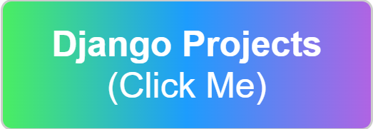

<h1 align="center">
  
</h1>
<h5 align="center">
  <code><a href="https://www.linkedin.com/in/abdullah-ceylan-27718b231/" target="_blank" title="LinkedIn Profile"> LinkedIn</a></code>
  <code><a href="https://twitter.com/abdllhceylan" target="_blank" title="Twitter Profile"> Twitter</a></code>
</h5>
 

  Hi,I'm Abdullah CEYLAN,Fullstack Developer from Turkey
   
   
  🔬 I am currently training for Fullstack Developer at Clarusway
   
  🎓 I graduated from Anadolu University Public Administration graduate.
   
  💻 I love writing code and learn anythings about it
   
  📚 I'm currently learning JAVASCRİPT,HTML,CSS.
   
  💬 Ask me anything about from <a href="https://github.com/axel-ac/axel-ac/issues" title="Issues">Here</a>
   
  📫 How to reach me: <a href="abdullahceylan.axel@gmail.com">abdullahceylan.axel@gmail.com</a>

<h2 align="center">🔥 Languages & Frameworks & Tools & Abilities 🔥</h2>
 

  <code></code>
  <code></code>
  <code></code>
  <code></code>
  <code></code>
  <code></code>
  <code></code>
  <code></code>
  <code></code>
  <code></code>
  <code></code>

<h2 align="center">⚡ Stats ⚡</h2>
 

  

    
    
  

           
  

    
  

   
  

<!-- <h2 align="center">👨‍💻 Repositories 👨‍💻</h2>
 

  

      

  

 -->
      
<h4 align="center">
  <a href="https://github.com/axel-ac?tab=repositories" title="Show Repositories">🔎 Show More 🔍</a>
</h4>
